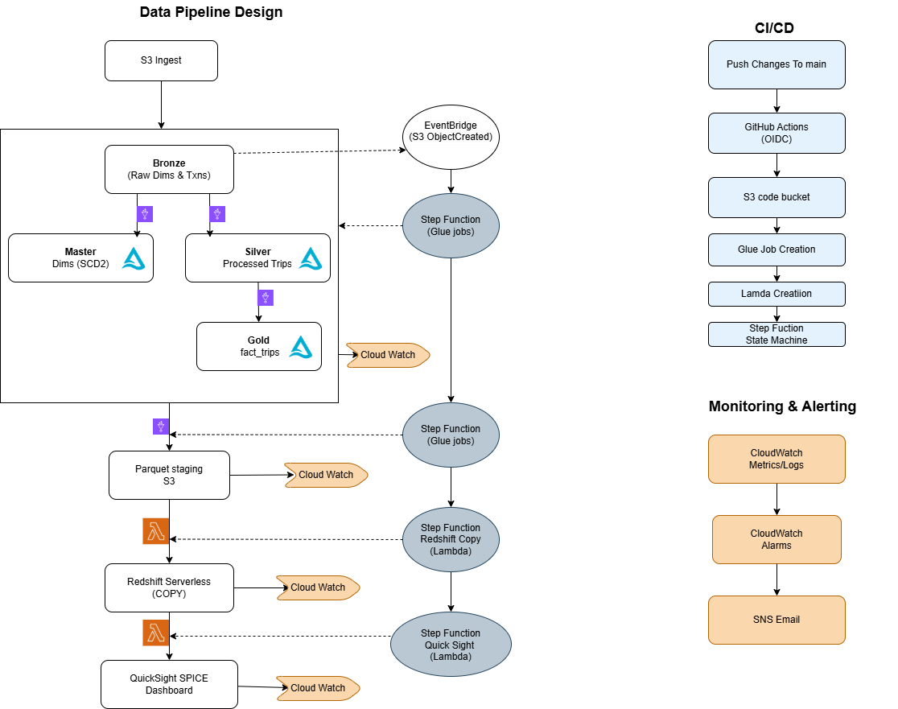

# Demo Data Pipeline

This repository includes a complete demo implementation under `demo/` for an AWS-based taxi analytics pipeline. It combines medallion-style lake layers, master data management (MDM), orchestration, Redshift serving, and QuickSight refresh automation.

## Architecture

The demo flow is:

1. Raw taxi and reference data lands in the bronze layer.
2. Glue jobs build mastered dimensions in `master/` and curated trip data in `silver/`.
3. A gold fact table is generated for analytics.
4. Export jobs write Parquet staging files for Redshift.
5. Step Functions orchestrates the pipeline, Lambda runs Redshift COPY and QuickSight refresh, and CloudWatch provides monitoring.

## Demo Folder Layout

### Top level

| Path | Purpose |
| --- | --- |
| `demo/demo_architec.drawio.png` | Main architecture diagram used in this README. |
| `demo/demo_architec.png` | Alternate exported architecture image. |
| `demo/README.md` | AWS CLI deployment and runbook for Glue jobs and export jobs. |
| `demo/governance.md` | Data governance notes covering ownership, lineage, quality, retention, and monitoring. |

### `demo/src/` Glue ETL jobs and helpers

| Path | Purpose |
| --- | --- |
| `demo/src/glue_utils.py` | Shared Glue and Spark initialization helper. |
| `demo/src/vendor_master.py` | MDM job for vendor mastering, match scoring, SCD2 merge, and debug outputs. |
| `demo/src/zone_master.py` | Zone dimension build and SCD2 merge job. |
| `demo/src/rate_code_ref.py` | Rate code reference dimension build and SCD2 merge job. |
| `demo/src/payment_type_ref.py` | Payment type reference dimension build and SCD2 merge job. |
| `demo/src/trips_processed.py` | Bronze-to-silver trip standardization and enrichment job. |
| `demo/src/fact_trips.py` | Silver-to-gold fact aggregation job for trip analytics. |
| `demo/src/export_master_parquet.py` | Exports current master dimensions to Parquet for Redshift COPY. |
| `demo/src/export_fact_parquet.py` | Exports gold fact data to Parquet for Redshift COPY. |
| `demo/src/__pycache__/vendor_master.cpython-312.pyc` | Generated Python bytecode artifact. |

### `demo/lambda/` orchestration helpers

| Path | Purpose |
| --- | --- |
| `demo/lambda/redshift_data_api.py` | Lambda wrapper for executing Redshift Data API SQL statements. |
| `demo/lambda/quicksight_refresh.py` | Lambda function that triggers QuickSight dataset ingestions. |

### `demo/orchestration/` workflow definitions

| Path | Purpose |
| --- | --- |
| `demo/orchestration/README.md` | Setup guide for Step Functions, EventBridge, and Lambda permissions. |
| `demo/orchestration/state_machine.json` | End-to-end Step Functions workflow for master, silver, gold, Redshift, and QuickSight steps. |
| `demo/orchestration/eventbridge_pattern.json` | EventBridge pattern for S3 object-created events under the bronze prefix. |

### `demo/sql/` warehouse and lake SQL

| Path | Purpose |
| --- | --- |
| `demo/sql/create-databases.sql` | Creates Glue catalog databases for gold, master, silver, and debug layers. |
| `demo/sql/bronze-ddl.sql` | Athena external table DDL for bronze source tables and partitions. |
| `demo/sql/redshift-ddl.sql` | Redshift schema and table DDL for mastered dimensions and fact table. |
| `demo/sql/quality-dashboard.sql` | Redshift quality views for null and negative-value checks. |
| `demo/sql/query.sql` | Sample ad hoc queries for validating vendor and silver/gold outputs. |

### `demo/cloudwatch/` monitoring assets

| Path | Purpose |
| --- | --- |
| `demo/cloudwatch/dashboard.json` | CloudWatch dashboard definition for Step Functions, Lambda, EventBridge, and Redshift metrics. |
| `demo/cloudwatch/alarms.md` | CLI commands to create and remove alarms for orchestration and Lambda failures. |

### `demo/tests/` local validation

| Path | Purpose |
| --- | --- |
| `demo/tests/conftest.py` | Pytest fixtures, Spark session setup, and Glue module mocking. |
| `demo/tests/test_vendor_master.py` | Integration-style tests for vendor mastering logic. |
| `demo/tests/__init__.py` | Test package marker. |

### `demo/scripts/` local execution support

| Path | Purpose |
| --- | --- |
| `demo/scripts/run_vendor_master_local.py` | Local Spark runner for exercising vendor master logic outside Glue. |

### `demo/plans/` design and implementation notes

| Path | Purpose |
| --- | --- |
| `demo/plans/plan.md` | Medallion lake design, logical model, and Spark processing plan. |
| `demo/plans/MDM_Architecture_Plan.md` | Detailed MDM architecture and implementation planning document. |
| `demo/plans/rest_of_dim_impl.md` | Notes for remaining dimension implementation work. |
| `demo/plans/vendor-silver-gold-plan.md` | Vendor silver-to-gold transformation and identity resolution design. |

## What To Read First

- Start with `demo/demo_architec.drawio.png` for the system view.
- Use `demo/README.md` for Glue deployment commands.
- Use `demo/orchestration/README.md` for workflow wiring.
- Use `demo/governance.md` and `demo/cloudwatch/` for operational controls.
- Use `demo/tests/` and `demo/scripts/` for local validation.
