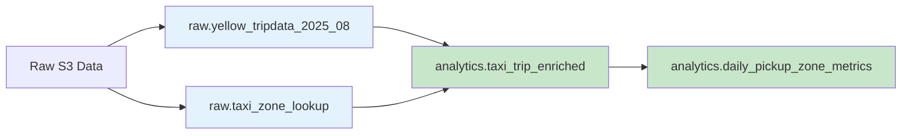
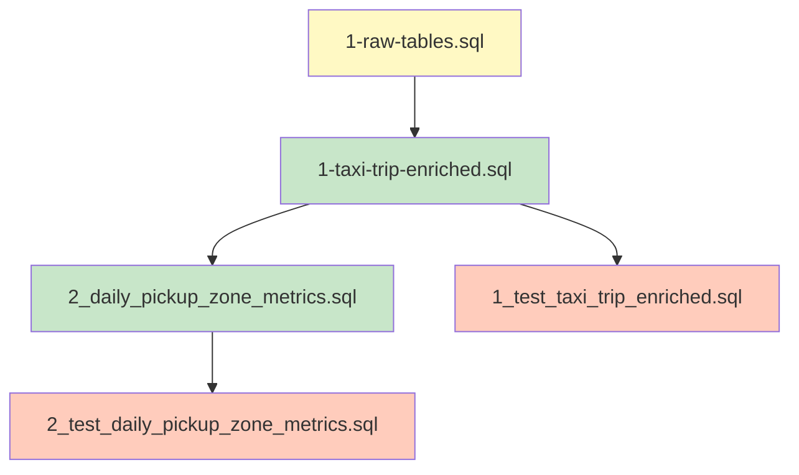

# Transformation Documentation - Day 12-13

## Overview
This documentation covers the SQL-based data transformation pipeline for NYC taxi trip data, implemented in AWS Athena with Parquet storage on S3.

---

## 1. Data Architecture Overview

### 1.1 Data Flow Diagram


### 1.2 Storage Layers
| Layer | Database | Table | Format | S3 Location |
|-------|----------|-------|--------|-------------|
| Raw | `raw` | `yellow_tripdata_2025_08` | Parquet | `s3://day-7-glue-etl-quality/landing-data/transactions/` |
| Raw | `raw` | `taxi_zone_lookup` | CSV | `s3://day-7-glue-etl-quality/landing-data/zone/` |
| Curated | `analytics` | `taxi_trip_enriched` | Parquet | `s3://day11-12-sql-glue/curated/taxi_trip_enriched/` |
| Curated | `analytics` | `daily_pickup_zone_metrics` | Parquet | `s3://day11-12-sql-glue/curated/daily_pickup_zone_metrics/` |

---

## 2. Transformation 1: Taxi Trip Enrichment

### 2.1 Purpose
Create an analytics-ready taxi trips table enriched with pickup/dropoff zone attributes for downstream reporting and analysis.

### 2.2 Source Tables
- [`raw.yellow_tripdata_2025_08`](setup/1-raw-tables.sql:35) - Raw taxi trip records
- [`raw.taxi_zone_lookup`](setup/1-raw-tables.sql:15) - Zone reference data

### 2.3 Transformation Logic

#### Stage 1: Base Trips CTE
Extracts raw trip data and derives `pickup_date` from `tpep_pickup_datetime`.

```sql
SELECT
  vendorid,
  tpep_pickup_datetime,
  tpep_dropoff_datetime,
  passenger_count,
  trip_distance,
  ratecodeid,
  store_and_fwd_flag,
  pulocationid,
  dolocationid,
  payment_type,
  fare_amount,
  extra,
  mta_tax,
  tip_amount,
  tolls_amount,
  improvement_surcharge,
  total_amount,
  congestion_surcharge,
  airport_fee,
  CAST(date(tpep_pickup_datetime) AS date) AS pickup_date
FROM raw.yellow_tripdata_2025_08
```

#### Stage 2: Validated Trips CTE
Applies data quality filters:
- `tpep_pickup_datetime IS NOT NULL`
- `tpep_dropoff_datetime IS NOT NULL`
- `tpep_dropoff_datetime >= tpep_pickup_datetime`
- `pulocationid IS NOT NULL`
- `dolocationid IS NOT NULL`
- `trip_distance >= 0`
- `total_amount >= 0`

#### Stage 3: Zone Enriched CTE
Joins validated trips with zone lookup twice:
- **Pickup zone**: `LEFT JOIN raw.taxi_zone_lookup pu ON t.pulocationid = pu.locationid`
- **Dropoff zone**: `LEFT JOIN raw.taxi_zone_lookup do ON t.dolocationid = do.locationid`

Calculates derived metric:
- `trip_duration_minutes` = `(date_diff('second', pickup, dropoff) / 60.0)`

### 2.4 Output Schema
| Column | Type | Description |
|--------|------|-------------|
| `vendorid` | int | Taxi vendor identifier |
| `tpep_pickup_datetime` | timestamp | Trip pickup timestamp |
| `tpep_dropoff_datetime` | timestamp | Trip dropoff timestamp |
| `passenger_count` | int | Number of passengers |
| `trip_distance` | double | Trip distance in miles |
| `trip_duration_minutes` | double | Calculated trip duration |
| `pulocationid` / `dolocationid` | int | Pickup/dropoff zone IDs |
| `pickup_borough` / `dropoff_borough` | string | Borough names |
| `pickup_zone` / `dropoff_zone` | string | Zone names |
| `pickup_service_zone` / `dropoff_service_zone` | string | Service zone classifications |
| `payment_type` | int | Payment method code |
| `fare_amount`, `extra`, `mta_tax`, `tip_amount`, `tolls_amount`, `improvement_surcharge`, `congestion_surcharge`, `airport_fee` | double | Fare components |
| `total_amount` | double | Total fare |
| `pickup_date` | date | Partition key |

### 2.5 Partitioning
- **Partition column**: `pickup_date`
- **Format**: Parquet

---

## 3. Transformation 2: Daily Pickup Zone Metrics

### 3.1 Purpose
Aggregate daily taxi KPIs by pickup zone for reporting and dashboards.

### 3.2 Source Table
- [`analytics.taxi_trip_enriched`](transforms/1-taxi-trip-enriched.sql:20)

### 3.3 Aggregation Logic
Groups by `pickup_borough`, `pickup_zone`, and `pickup_date`:

| Metric | Aggregation | Description |
|--------|-------------|-------------|
| `trip_count` | `COUNT(*)` | Number of trips per zone per day |
| `avg_trip_distance` | `AVG(trip_distance)` | Average trip distance |
| `avg_trip_duration_minutes` | `AVG(trip_duration_minutes)` | Average trip duration |
| `avg_total_amount` | `AVG(total_amount)` | Average fare amount |
| `sum_total_amount` | `SUM(total_amount)` | Total revenue per zone per day |

### 3.4 Output Schema
| Column | Type | Description |
|--------|------|-------------|
| `pickup_borough` | string | Borough name |
| `pickup_zone` | string | Zone name |
| `trip_count` | bigint | Number of trips |
| `avg_trip_distance` | double | Average distance |
| `avg_trip_duration_minutes` | double | Average duration |
| `avg_total_amount` | double | Average fare |
| `sum_total_amount` | double | Total revenue |
| `pickup_date` | date | Partition key |

### 3.5 Partitioning
- **Partition column**: `pickup_date`
- **Format**: Parquet

---

## 4. Data Quality Tests

### 4.1 Tests for `taxi_trip_enriched` ([`tests/1_test_taxi_trip_enriched.sql`](tests/1_test_taxi_trip_enriched.sql:1))

| Test Name | Condition | Expected Result |
|-----------|-----------|-----------------|
| `pickup_zone_null` | `pickup_zone IS NULL` | 0 failing rows |
| `dropoff_before_pickup` | `tpep_dropoff_datetime < tpep_pickup_datetime` | 0 failing rows |
| `negative_total_amount` | `total_amount < 0` | 0 failing rows |
| `negative_trip_distance` | `trip_distance < 0` | 0 failing rows |

### 4.2 Tests for `daily_pickup_zone_metrics` ([`tests/2_test_daily_pickup_zone_metrics.sql`](tests/2_test_daily_pickup_zone_metrics.sql:1))

| Test Name | Condition | Expected Result |
|-----------|-----------|-----------------|
| `pickup_date_null` | `pickup_date IS NULL` | 0 failing rows |
| `pickup_zone_null` | `pickup_zone IS NULL` | 0 failing rows |
| `nonpositive_trip_count` | `trip_count <= 0` | 0 failing rows |
| `duplicate_daily_zone_key` | Duplicate `(pickup_date, pickup_zone)` | 0 failing rows |

---

## 5. Dependencies & Execution Order



**Execution Sequence:**
1. Run [`setup/1-raw-tables.sql`](setup/1-raw-tables.sql:1) - Create raw tables
2. Run [`transforms/1-taxi-trip-enriched.sql`](transforms/1-taxi-trip-enriched.sql:1) - Create enriched table
3. Run [`transforms/2_daily_pickup_zone_metrics.sql`](transforms/2_daily_pickup_zone_metrics.sql:1) - Create metrics table
4. Run [`tests/1_test_taxi_trip_enriched.sql`](tests/1_test_taxi_trip_enriched.sql:1) - Validate enriched table
5. Run [`tests/2_test_daily_pickup_zone_metrics.sql`](tests/2_test_daily_pickup_zone_metrics.sql:1) - Validate metrics table

---

## 6. Key Design Decisions

| Decision | Rationale |
|----------|-----------|
| **LEFT JOIN for zones** | Preserves trips even if zone lookup is missing |
| **Partitioning by pickup_date** | Enables efficient date-based queries and partition pruning |
| **Parquet format** | Columnar storage for better compression and query performance |
| **Validation in CTE** | Filters bad data early in the pipeline |
| **Separate metrics table** | Pre-aggregated for dashboard performance |

---

## 7. File Structure

```
day-12-13/
├── setup/
│   └── 1-raw-tables.sql              # Raw table definitions
├── transforms/
│   ├── 1-taxi-trip-enriched.sql      # Enrichment transformation
│   └── 2_daily_pickup_zone_metrics.sql # Aggregation transformation
├── tests/
│   ├── 1_test_taxi_trip_enriched.sql # Data quality tests for enriched table
│   └── 2_test_daily_pickup_zone_metrics.sql # Data quality tests for metrics table
└── TRANSFORMATION_DOCUMENTATION.md   # This file
```

---

## 8. Authors & Ownership

- **Author**: Savitha
- **Owner**: Data Engineering Team
- **Last Updated**: 2025-01-10
